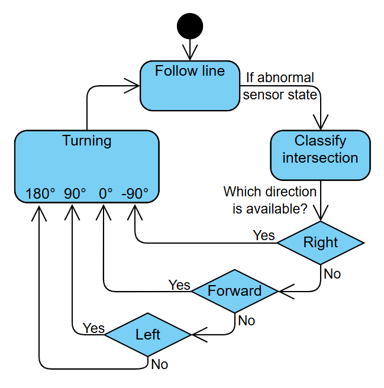

# The Maze Solver
Building a line-following maze-solving algorithm is no easy feat so here is a guide to get you started. This document will only go through the most basic method and will only give you pointers to more complex solutions if you wish to take on the challenge. If you want to try to solve the problem on your own, do not continue reading. The problem can be divided into 5 main parts: following a straight line, detecting an intersection or dead end, classifying an intersection, choosing which turn to take, and turning. Since the robot will only ever do one of these tasks at a time, it is effective to model the robot as a so-called state machine. Note that of the previous 5 parts; 3 are states and 2 are transitions. There are more transitions but they are considered trivial.
## The State Machine
### 1. Following a straight line (state)
This is by far the easiest task and therefore a good place to start. The goal is to be able to follow a straight line, even under slight perturbations. Under ideal conditions, the robot would be placed head-on along the line and therefore only the center sensor would be active. In this case, all we have to do is drive forward. Of course, due to the fact that aligning the robot perfectly is impossible, the robot will slowly drift to one side at which point both the center and one of the side sensors will be active at the same time. Under extreme conditions it might even go so far as to deactivate the center sensor. In any case, you now know which side of the robot the line is at and all you have to do is slighly turn it in the direction of the line. This should now align the robot with the line again and voilà, a line following algorithm has been born. At any point during this state the robot may encounter an intersection.
### 2. Detecting an intersection or dead end (transition)
Since only ever the central three sensors will be used to follow a straight line, activation of the distal two means that we've encountered an intersection and the state machine is now sent into the classify intersection state. If the robot ever loses the line completely when it was previously following it perfectly, we know we've encountered a dead end, and we must turn around. We can use the classifying an intersection state for dead ends too for simplicity.
### 3. Classifying an intersection (state)
The goal of this state is to take the robot from just having encountered an intersection, to knowing which of the left, forward, and right directions are possible to go next. To do this, we will perform a sweep. Since the robot has just encountered that a right or left turn exists using the distal sensors, it is too far back to be able to even see a forwards connection. Therefore, the robot will drive forwards slowly, at every point recording if it has encountered lines on the distal sensors to the left or right. When the robot has moved forwards far enough, the left and right distal sensors will now not see the lines anymore. At this point if the central three sensors still detect a line, there exists a line going forwards. If the distal sensors to the left or right saw a line at any point during the sweep, a left or right connection exists respectively.
### 4. Choosing which turn to take (transition)
This is by far the task which has the highest variance in solution complexity. Therefore, I will only cover the simplest solution and give you some ideas for more complex solutions towards the end of this document. Since the maze, as described in the competition document, only has one path between any two cells in the maze, we can always follow one wall and we're guaranteed to reach every point of the maze, including the end. The idea is to pick a hardcoded direction, for example right, and **always** choose turns in the following priority: right, forwards, left, and of course turn around if it's a dead end.
### 5. Turning (state)
Since the robot has motor encoders, it's possible to measure how much the robot has rotated by converting the distance traveled by the wheels along a circular arc to the angle it makes. This means that we can safely rotate the robot by said angle at which point (if the classification was correct), we should see a line within our central three sensors and we transition back to the following line state.
## General Tips
Note that the real world isn't perfect and it's bad practice to assume everything will just work. Therefore, it's good to weave in backups for when things go wrong. Here's a short list of some things that could go wrong: a line sensor says that it sees a line even if it doesn't or vice versa for a short period of time; the wheels slip slightly during a turn, making it turn less than the desired amount; the robot somehow bugs out, jumps, does a flip, dances and is now completely lost and has no idea where it or the line is. These problems, and more, are things you'll have to consider to design a robust line-following maze-solving robot. As for where to begin thinking about how to design a better solution to task 4, remember that you may return to the beginning to reset the timer. I won't say more than that. Good luck!
## Appendix
Below is a visualization of the minimum viable state machine.

